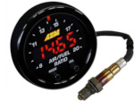

# PyCosworth

PyCosworth is a monitoring, data-logging and diagnostic tool for (primarily Escort/Sierra Cosworth) vehicles equipped with the [Magneti Marelli L8/P8 ECU](http://www.bigturbo.co.uk) which have the serial datastream protocol enabled.


This feature is often called the *Pectel Datastream*, but is simply a feature of the ECU itself - being turned on or off based on the type of ROM chip fitted to the ECU. Some aftermarket ROM chips available from tuning firms can optionally enable this feature where it was not available by the manufacturer.

*PyCosworth* interfaces with the serial connection to display, monitor and log the information available via that datastream, similar to such products as:

* The [SECS Monitor](https://www.google.co.uk/search?q=cosworth+secs+monitor)
* RP Labs IAW Monitor available from [RPLabs](http://rp-lab.com/iaw_monitor.shtml) or [Motorsports Developments](http://www.motorsport-developments.co.uk/iaw.html)

These products are great for their intended use, but are either *a: very expensive*, or *b: designed for use on a laptop*. PyCosworth is intended to to on a cheap embedded device such as a Raspberry Pi, BeagleBoard or other small Linux system and be permanently connected to the vehicle.

---

# Using PyCosworth

Further details about PyCosworth are [on my website](https://www.target-earth.net/wiki/doku.php?id=blog:car_stuff_pycosworth).

## Hardware Requirements

* A vehicle with a **serial datastream enabled** Magneti Marelli ECU, specifically:

| Model | ECU Type |
| ----- | ------------ |
| Ford Sierra Cosworth 4x4 | Weber/Marelli L8 ECU (with serial comms enabled via software) |
| Ford Escort Cosworth | Weber/Marelli P8 ECU |

 

*Any other Cosworth YB engine with one of the above ECU variants retro-fitted should also work*

* A diagnostic cable that interfaces with the ECU.

*Please note that these are specific diagnostic cables that connect to the 3 pin flash-code cable on the factory Ford loom, convert it to a RS232 compatible serial interface and then convert that serial interface into a USB plug for use on modern computers. Common OBD/OBDII interfaces will **not** work with the Weber Marelli serial datastream. Ask your usual Cosworth specialist or forum on how to obtain one.*


* A Linux computer running Python (both 2.x and 3.x supported) with at least one free USB port for the USB to RS232/TTL diagnostic cable. A basic laptop will be fine - the application isn't memory, cpu or graphically intensive.


* *Optionally:* **A Raspberry Pi (1/2/3, A, B or B+)** with exposed GPIO pins to use optional **in-car** push buttons to control system functionality. Without buttons you will not be able to control the application if you have an embedded system like the Pi. A total of **four** buttons are reccomended:
    * Button 1: Start/Stop data logging
    * Button 2: Cycle to next sensor display
    * Button 3: Restart ECU comms
    * Button 4: Power on/off (if on a supported battery/UPS power supply)


* *Optionally:* **An SSH1102 or SSD1306 miniature OLED screen** supported by the Python [luma.oled driver](https://luma-oled.readthedocs.io/en/latest/) (the 1.3" screens with 128x64 pixels are strongly reccomended) for **in-car** live sensor/data visualisation.

* *Optionally:* **A supported X11 display or desktop interface** to emulate the live sensor/data visualisation as would be seen in the OLED screens, in a desktop window.



* *Optionally:* **An AEM Wideband X-Series Air Fuel Ratio sensor** and gauge with serial datastream output. *You will need a secondary USB to RS232 adapter for the AEM sensor/gauge*.

None of the optional components are necessary in any way to run the software, but functionality will be limited to text-mode display and datalogging to file.

The addition of an AEM Wideband sensor and gauge makes it possible to simultaneously log AFR data at the same time as the main Cosworth ECU sensors. If you have another device that you wish to add support for, please let me know.

It it not designed to work (and I have no way to test) on the Fiat/Lancia or *Ferrari F40!* version of the ECU, but *may* work. However, an [excellent tool already exists](http://www.nailed-barnacle.co.uk/coupe/startrek/startrek.html), that the comms protocol part of PyCosworth is partly based on. Many thanks to Neil, the author of that tool, for his technical information. 

### Hardware Configuration Guide

There are too many variables to say *this is exactly how to do it*, but I've documented how *my* setup is connected together in the hardware guide on my website:

   * [Example PyCosworth hardware configuration](https://www.target-earth.net/wiki/doku.php?id=blog:car_stuff_pycosworth_hardware)

## Software Requirements

All of the *Python* software library requirements are listed in the *requirements.txt* file, simply run:
```
pip install -r requirements.txt
```
... to install them on your Linux system.

On Raspbian systems, first check [Raspbian.md](docs/Raspbian.md) for any pre-requisites needed. There are several software packages needed to support the hardware devices used on that platform.

The [Raspbian.md](docs/Raspbian.md) guide also lists a number of software configuration changes you may need to make to your Pi in order make it boot faster as well as increase speed of data display and enable the optional hardware listed above, to work.

## Running PyCosworth

To start the monitoring programme, type `./SensorDashboard` in the programme directory. The monitor will start and within a few seconds it should communicate with the ECU and start gathering data.

### Normal Interface

At start up a short banner message will be shown whilst sensors and graphics are loaded and initialised. 

After initialisation is complete, the application will immediately move to the first defined sensor that is set in the [the configuration file](docs/Configuration.md).

You can cycle through the available Cosworth sensors (*AMAL* valve duty cycle, *ECT*: Engine Coolant Temperature, *IAT*: Intake Air Temperature, *INJDUR*: Injector Pulse Width Duration, *BAT*: Battery voltage, *CO*: Base Fuelling, *IGNADV*: Ignition Advance, *TPS*: Throttle Position, *MAP*: Manifold Pressure and *RPM*) with a single press of **Button 2** at any time. In addition *AFR* is available if you have enabled the AEM Wideband sensor support.

  

The units the sensors are reading in are automatically shown to the right of the sensor value; whether this is a percentage, degrees centigrade, voltage, millibars or some other unit.

### Comms Errors

If, on starting the application the cable is not fully connected to the ECU, or the vehicle ignition is not live a warning message will be displayed in the lower left corner of the screen.

You can press **Button 3** to re-establish communication links with the supported sensors (Cosworth ECU and AEM Wideband AFR) without powering the device off. Whilst comms are being restarted a wait message will be shown on-screen.

  

### Additional Functions

You can access a demo mode to test your hardware by running the application in *Demo Sensor* mode - this generates a never-ending stream of bogus sensor data for each of the sensors you have activated. **Demo Mode** is indicated by the status display in the top right corner of the screen.

In addition, you can start or stop logging at any point in time by pressing **Button 1** and a log of the active sensors will be recorded to disk/SD card. **Logging Mode** is indicated by the status display in the bottom right corner of the screen.

 

The file that the sensor data is recorded to is an industry standard comma-seperated-value text file:


The *Counter* column is the sensor-reading pass that recorded the data. From the point at which the ECU is connected, the data is continually sampled; each pass having a unique ID for the duration that the device is powered on.

The *Time* column is the time relative to the first sensor reading. Since the Raspberry Pi and other similar embedded devices do not have clocks, there is no guarantee we can use a HH:MM:SS format, so we record each log of sensor readings as an offset (in seconds) from the first reading.

## Configuration

All of the user-customisable settings are found in the file `libs/settings.py`. This includes an extensive set of optional modules and complete customisation over which sensors are monitored, their update frequency (subject to the speed of the ECU) as well as total control over the layout and display modes of the in-car visualisation and display options.

Please see [the configuration guide](docs/Configuration.md) for full details.

---

# Pectel Datastream

## Description

For full details of the Pectel serial datastream, see [the Cosworth Pectel datastream protocol](docs/Pectel.md) document.